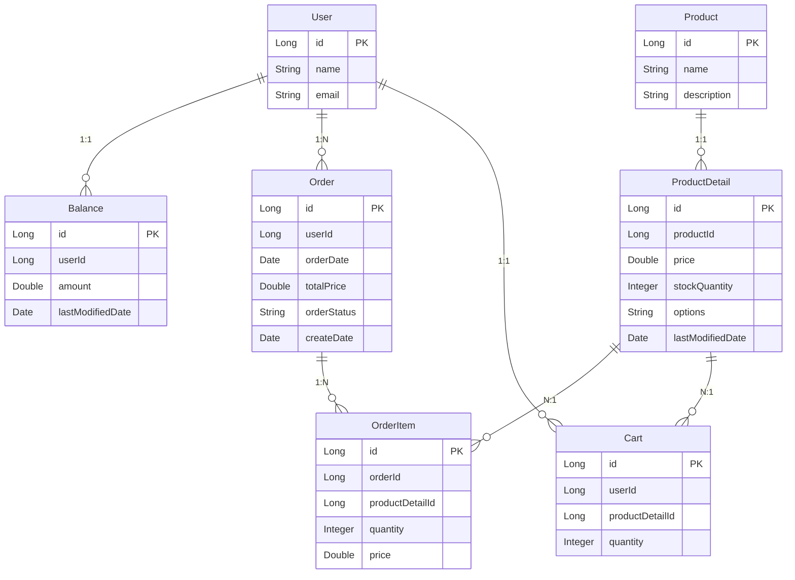

### ERD

```mermaid
erDiagram
    User {
        Long id PK
        String name
        String email
    }

    Balance {
        Long id PK
        Long userId
        Double amount
        Date lastModifiedDate
    }

    Product {
        Long id PK
        String name
        String description
    }

    ProductDetail {
        Long id PK
        Long productId
        Double price
        Integer stockQuantity
        String options
        Date lastModifiedDate
    }

    Order {
        Long id PK
        Long userId
        Date orderDate
        Double totalPrice
        String orderStatus
        Date createDate
    }

    OrderItem {
        Long id PK
        Long orderId
        Long productDetailId
        Integer quantity
        Double price
    }

    Cart {
        Long id PK
        Long userId
        Long productDetailId
        Integer quantity
    }

    User ||--o{ Balance : "1:1"
    User ||--o{ Order : "1:N"
    Order ||--o{ OrderItem : "1:N"
    User ||--o{ Cart : "1:1"
    Product ||--o{ ProductDetail : "1:1"
    ProductDetail ||--o{ OrderItem : "N:1"
    ProductDetail ||--o{ Cart : "N:1"

```
