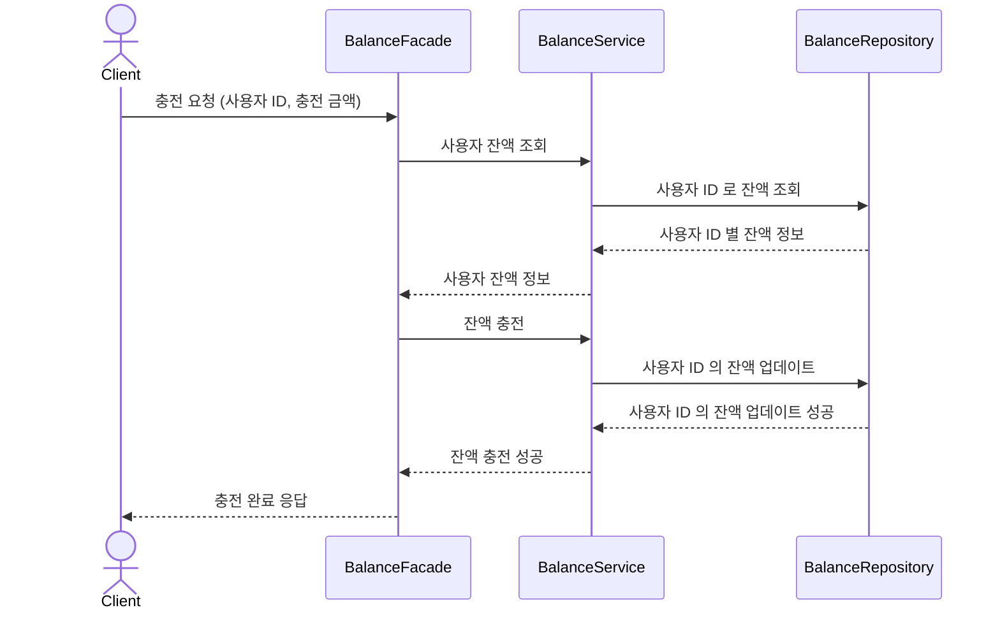
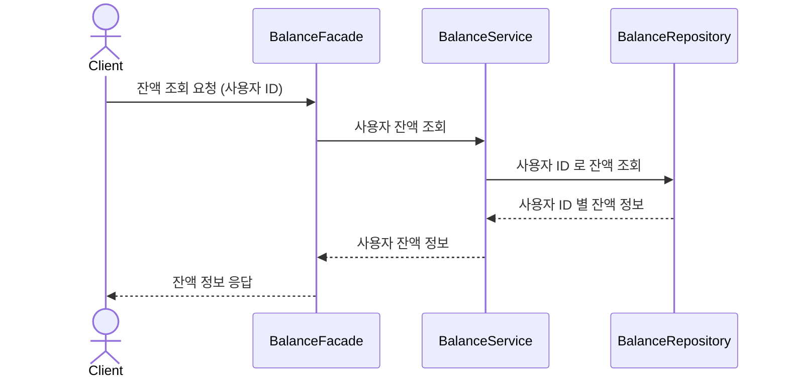
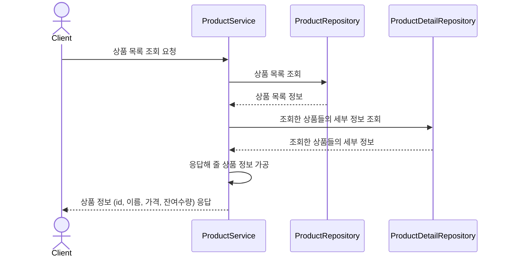
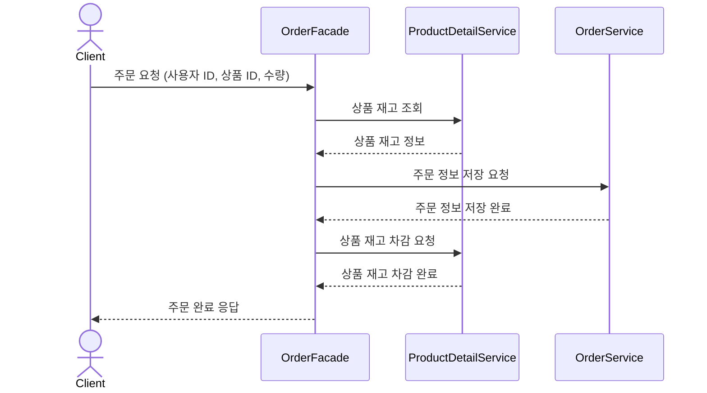
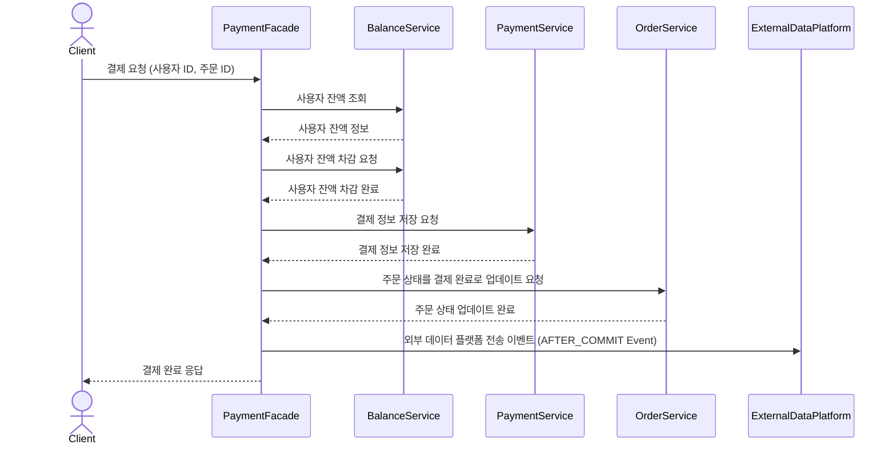
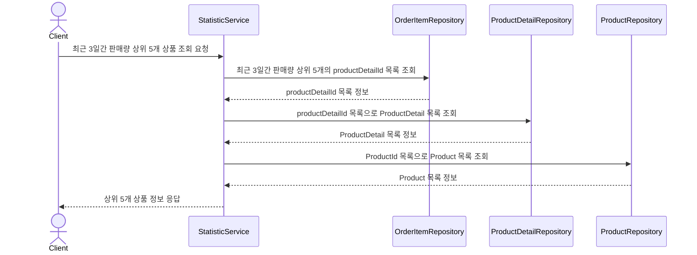
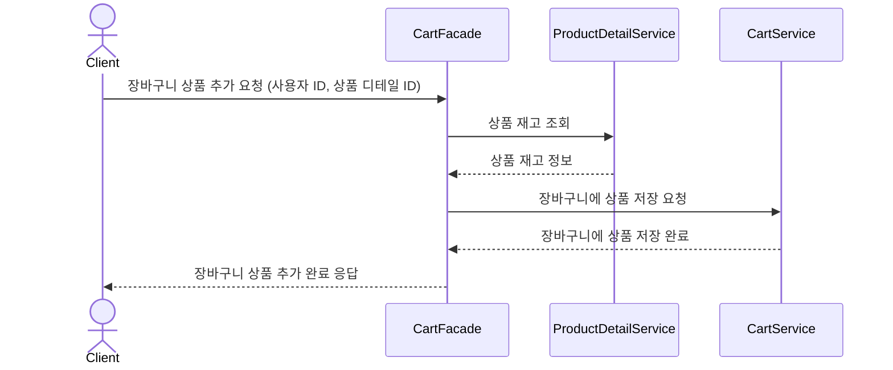
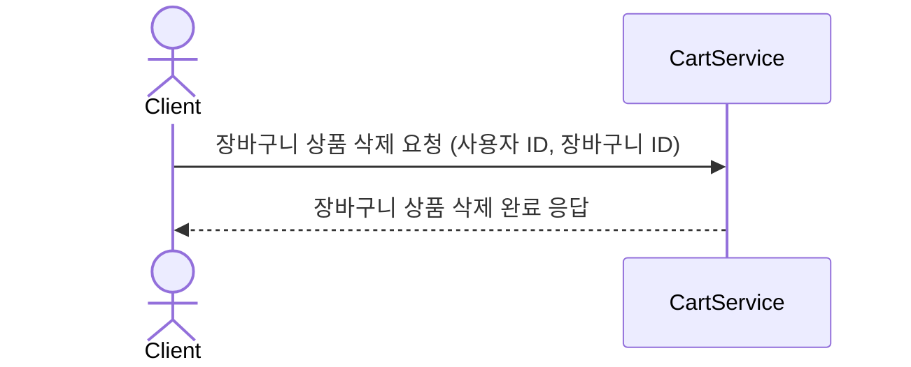
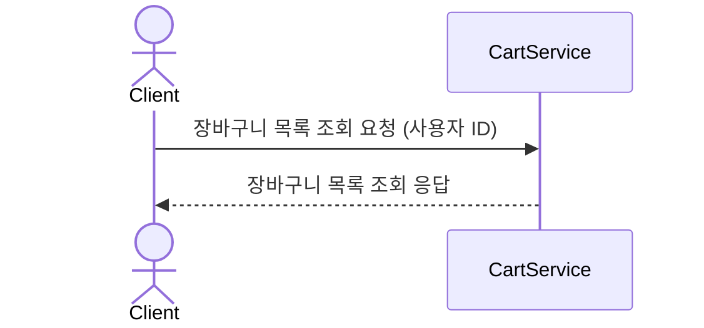

### 시퀀스 다이어그램
#### 잔액 충전 / 조회
##### 잔액 충전
1. 클라이언트의 충전 요청
2. 사용자의 충전 금액 확인
3. 충전 처리 후 성공 응답 반환

###### 잔액 조회
1. 클라이언트의 잔액 조회 요청
2. 사용자 정보로 잔액 조회 후 반환

#### 상품 조회
1. 클라이언트의 상품 조회 요청
2. 상품 목록 및 재고 반환

#### 주문 / 결제
##### 주문
1. 클라이언트가 상품을 주문하고 결제 요청 보냄
2. 상품의 재고 확인
3. 사용자의 잔액 조회
4. 주문 정보 저장
5. 재고 차감

##### 결제
1. 주문 정보 조회
2. 사용자의 잔액 차감
3. 결제 정보 저장
4. 주문 정보에서 결제 완료로 상태 업데이트
5. 외부 데이터 플랫폼에 전송

#### 상위 상품 통계
1. 클라이언트가 최근 3일간 가장 많이 팔린 상위 5개의 상품 정보를 요청
2. OrderItem 테이블에서 최근 3일간 가장 많이 팔린 상품 디테일 목록을 상위 5개 조회
3. ProductDetail 테이블에서 상위 5개에 해당하는 상품 디테일 정보 조회
4. Product 테이블에서 상위 5개에 해당하는 상품 정보 조회
5. 상위 상품 목록 응답

#### 장바구니 기능
##### 장바구니에 상품 추가
1. 상품의 재고 확인
2. 재고 존재하면 상품 장바구니에 추가

##### 장바구니 상품 삭제
1. 상품을 장바구니에서 삭제

##### 장바구니 조회
1. 현재 장바구니에 담긴 상품 조회

